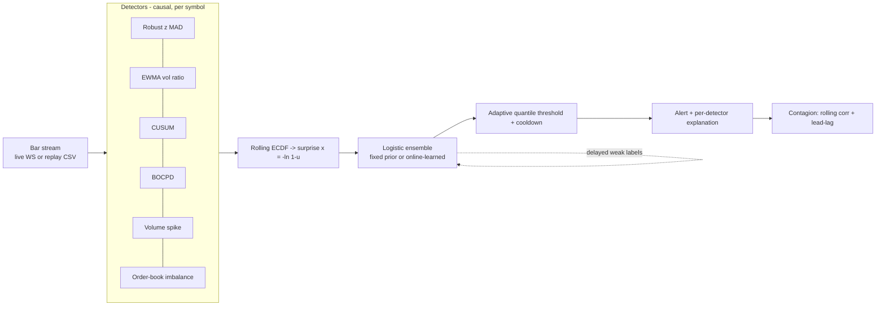
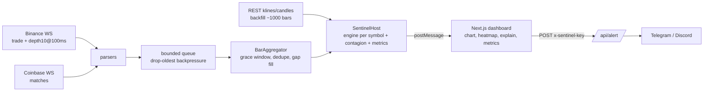

# SENTINEL

Real-time market anomaly detection: an ensemble of robust statistical detectors
with adaptive false-alarm control, evaluated by a lookahead-free replay harness.

**Research question:** can an ensemble of robust detectors flag regime breaks earlier
and with fewer false alarms than a single z-score, *at an equal alarm budget*?

> **Status (milestone 2 of 3):** engine + replay harness (milestone 1) and now the live stack: tick->bar
> aggregator, Binance/Coinbase feeds, Web Worker host, Next.js dashboard, alert route.
> No real-market results have been produced yet; the only numbers so far are from synthetic data
> and are a plumbing check, not evidence. **The Next.js UI has not been compiled or run yet** (see Limitations).

## Architecture



The same `SentinelEngine.update(bar)` runs live (in a Web Worker) and in
replay, so there is no train/serve skew, and lookahead is structurally impossible
(a unit test feeds two engines different futures and asserts identical past outputs).

## Live stack (milestone 2)



Everything heavy runs in a Web Worker. Reconnects use exponential backoff with jitter and a
stale-connection watchdog; out-of-order and duplicate trades are handled in the aggregator;
the queue drops oldest under overload and reports it in the metrics bar. 60 s bars are
warm-started from REST history so the engine is ready immediately (shorter bars warm up live).

### Run locally
```bash
npm install
npm run dev        # http://localhost:3000, press Start
```
US users: pick "binance.us" in the header (binance.com is geo-blocked there).

### Deploy: GitHub -> Vercel
1. Push this repo to GitHub.
2. vercel.com > Add New Project > import the repo (Next.js is auto-detected).
3. Project Settings > Environment Variables: set `ALERT_API_KEY` (long random string) and the
   Telegram and/or Discord variables from `.env.example`. Redeploy.
4. In the deployed dashboard open "Alert rules", tick the box, paste the same `ALERT_API_KEY`.

The alert route fails closed (503 without a key, 401 with a wrong one), validates input
strictly, sends plain text only, and suppresses Discord mentions. All market data flows
browser <-> exchanges directly; Vercel only serves the page and relays alerts.

## Method (details in source comments)

- **Detectors**: median/MAD robust z; fast/slow EWMA volatility ratio; two-sided
  CUSUM on standardised returns; Bayesian online changepoint detection
  (Normal-Gamma, Student-t predictive, mass on short run lengths); volume / rolling
  median; robust z of L2 order-book imbalance (optional input).
- **Calibration to a common scale**: each statistic -> rolling ECDF (queried before
  insertion) -> surprise `x = -ln(1-u)`.
- **Ensemble**: `p = sigmoid(b + sum_j w_j x_j)`. *Fixed*: hand-set prior
  `p = sigmoid(1.5 (mean x - 3))`. *Learned*: online SGD with L2 pull to the prior,
  `w >= 0`, trained on **delayed weak labels** (a |return| >= 4 sigma occurs within
  the next 30 bars; applied only after those 30 bars have elapsed).
- **Alerts**: threshold = rolling `(1 - rho)` quantile of past `p`, with
  `rho = alarms_per_day * bar_seconds / 86400`, plus a cooldown with **severity escalation**:
  inside a cooldown an alert still fires if the score beats the `(1 - rho/10)` quantile of the
  past window (10x rarer than the alarm budget) and the previous alert's score.
- **Contagion**: rolling return correlation and lead-lag cross-correlation of score series.

## Run

```bash
npm install
npm test                 # 51 unit tests (node:test, no extra deps)
npm run typecheck
npm run eval:synth       # offline end-to-end replay on synthetic data

npm run eval:fetch       # download 1m klines from data.binance.vision (pure Node, no `unzip` needed)
npm run eval             # replay real stress events, writes results/summary.json + summary.md
```
Requires Node >= 22.18 (runs TypeScript natively).

## Real-data replay (do this next)

```bash
cp eval/events.example.json eval/events.json     # then refine (see below)
npm run eval:fetch -- --events eval/events.json  # ~100 KB per symbol-day, resumable, 404s are reported
npm run eval -- --events eval/events.json --ablate
```
Outputs `results/summary.json` (full detail) and `results/summary.md` (paste-ready tables:
summary, per-event latency matrix, leave-one-out ablations).

Before you trust the numbers:
1. **Refine `onset`** for each event from the price data (the example windows are whole days,
   so latency is otherwise measured from midnight). State in the writeup that onsets were
   labelled with hindsight, and label them *before* looking at any method's alerts.
2. **Do not tune hyperparameters on these events.** Defaults are fixed; if you change anything,
   say so and treat the events as no longer held out.
3. Some symbol/date files may 404 (e.g. LUNAUSDT after the rename to LUNC). Drop or rename those events.
4. The harness uses 3 days of warm-up before each event (`--warmup-days`) and measures false alarms
   only in quiet periods (outside windows, a 60 min pre-guard and a 6 h post-guard).
5. With 3-5 events there is no statistical significance; report case studies and ablation
   *direction*, not p-values.

## Evaluation protocol

All methods run through the identical harness (`eval/harness.ts`) with hyperparameters
fixed *before* looking at events. Baselines: `zscore_fixed3` (classic |z|>3) and
`zscore_matched` (same statistic, same adaptive threshold and alarm budget as SENTINEL).
Metrics: event recall, detection latency, false alarms/day in quiet periods, precision.

## Known limitations (read before quoting any number)

- **Cooldown masking (fixed in v0.1.1).** On synthetic data two false alarms 15 bars apart
  suppressed a genuine -3% jump (4/5 -> 5/5 seeds after the escalation rule; regression test included).
  The `zscore_fixed3` baseline keeps the classic plain cooldown on purpose.
- **Weak spots seen so far (synthetic):** a subtle 40-bar drift of -2 sigma/bar is caught in only
  2/5 seeds by every method, and the learned ensemble is not better than the fixed one.
  Escalation is a heuristic (factor 10), not tuned; ablate it in the real-data study.
- Event windows in `eval/events.example.json` are day-level and approximate; onsets are
  labelled with hindsight. Latency is only as good as those labels. 3-5 events give
  no statistical significance; report them as case studies.
- "Precision" is a lower bound: unlabelled but real anomalies outside the windows count as false alarms.
- Historical L2 order-book data is not freely available, so the order-book detector can
  only be evaluated on live data you record yourself. The replay uses trades/klines only.
- Weak labels are a proxy. The learned weights can only be as good as that proxy.
- The adaptive threshold lets a very long anomaly raise its own threshold.
- Volume has no intraday-seasonality adjustment; replay assumes minute bars without gaps.
- **Next.js UI is unverified.** I could not run `npm install`/`next build` where this was written. The pure
  logic (aggregator, socket, host, alerts, engine) is unit-tested; the React/lightweight-charts code was only
  type-checked against stubs. Expect small fixes on first `npm run build` (CI runs it).
- Coinbase has no order-book detector yet (would need a level2 book). Binance order-book imbalance uses
  partial-depth snapshots timestamped with the local clock (no exchange event time on that stream).
- Alerts fire only while a dashboard tab is open; 24/7 alerting needs a small always-on worker
  (Railway/Fly/Render). The route's rate limiter is in-memory, per serverless instance.
- The page is public by default: anyone can view it and run their own session. Only the alert route is key-protected.
- Research software, not a trading signal, not financial advice.

## Roadmap

2. ~~Aggregator, feeds, Worker host, dashboard, alert route~~ (done; needs first real build + live smoke test).
3. Real-data results, ablations (each detector removed), cooldown-escalation fix,
   calibration / Brier reporting, 4-page writeup in `docs/`.
