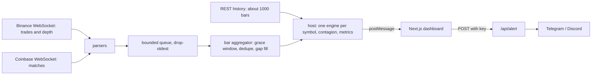

# SENTINEL

Real-time anomaly detection for crypto markets, with a pre-registered study and an exploratory follow-up testing whether it actually works.

**Live demo:** https://sentinel-one-phi.vercel.app &nbsp;·&nbsp; **Paper:** [docs/SENTINEL_paper.pdf](docs/SENTINEL_paper.pdf) &nbsp;·&nbsp; Research software, not financial advice.

## Headline results

Two evaluations on Binance BTCUSDT and ETHUSDT 1-minute data (2020 to 2026): **Study 1** (pre-registered, 40 stress days) and **Study 2** (exploratory follow-up designed after Study 1, 119 new events).

**Supported**
- **Fewer alerts at the same nominal budget.** At 6 alerts/day, 4.8 vs 6.7 quiet-period alerts per day against an equally thresholded z-score (Study 1: -1.86 per day, 95% CI -2.31 to -1.42); 4.90 vs 5.81 in Study 2.
- **Higher recall at a matched alert rate on held-out shocks** (the primary endpoint, stated in advance). At 5 alerts/day on 55 held-out shocks: recall 0.87 vs 0.72 for the z-score, a difference of **+0.15 (95% CI 0.06 to 0.26)**; a random alerter reaches 0.42.

**Not shown**
- Earlier detection (no latency difference), a benefit on 58 volatility-regime days (+0.06, CI -0.03 to 0.15), or a benefit from the online-learned weights.

**Not established**
- That *ensembling* is the cause. Post-hoc single-detector baselines show the ensemble clearly beats three of its five components (robust z, EWMA volatility and changepoint detection alone), but CUSUM alone and volume-spike alone are within noise of it (-0.07 and -0.05, intervals include 0).

The supported claim is an advantage over a naive z-score on large shocks, not detection skill in general and not trading value. The paper gives the protocol, all tables, and the limitations.

## What is here

- **Streaming engine** (TypeScript, causal, tested): robust z-score, EWMA volatility ratio, CUSUM, Bayesian online changepoint detection, volume spike, and order-book imbalance (live only). Each statistic is normalised by a rolling empirical CDF, combined by a logistic ensemble (fixed prior or online-learned from delayed weak labels), and turned into alerts by per-symbol adaptive quantile thresholds with a cooldown and severity escalation. Cross-asset lead-lag tracking.
- **Live dashboard** (Next.js, runs in your browser): Binance and Coinbase WebSockets, a Web Worker engine, price chart with anomaly score, heatmap, a "why did this fire" panel, throughput and latency metrics.
- **Alert route** (`/api/alert`): Telegram and Discord messages. Fails closed, validates input, plain text only.
- **Study harness**: random-alert chance baseline, comparison at matched realised alert rates, cluster-bootstrap intervals and paired comparisons, all run on GitHub Actions.
- **67 automated tests**, including one asserting that two engines fed different futures give identical past outputs (no lookahead).

## Architecture



The same `SentinelEngine.update(bar)` runs live and in replay, so there is no train/serve skew.

## Try it

- **Live:** open the demo and press **Start**. US users: pick *binance.us* in the header.
- **Locally** (Node 22 or newer):
  ```bash
  npm install
  npm run dev      # http://localhost:3000
  npm test         # 67 tests
  ```
- **Deploy:** import the repo on Vercel (Next.js is detected automatically). The alert route stays disabled until you set `ALERT_API_KEY` (and Telegram or Discord variables, see `.env.example`).

## Reproduce the studies

No local setup needed. In the repo open **Actions**, pick a workflow and press **Run workflow**; tables appear on the run summary and full results are attached as an artifact.

| Workflow | What it reproduces |
|---|---|
| `study` | Study 1 (pre-registered, 40 events) |
| `study2` | Study 2 (exploratory follow-up, matched alert rates, held-out events) |
| `study2b` | Study 2 plus the post-hoc single-detector baselines; reproduces every Study 2 number unchanged |

Frozen parameters: [`eval/study.json`](eval/study.json) and [`eval/study2.json`](eval/study2.json). Protocols: [docs/STUDY.md](docs/STUDY.md) and [docs/STUDY2.md](docs/STUDY2.md). Each result records the configuration hash and commit.

## Repository layout

| Path | Contents |
|---|---|
| `src/engine/` | detectors, ensemble, thresholds, contagion, engine |
| `src/feeds/` | aggregator, reconnecting socket, parsers, history, queue |
| `src/worker/` | host and Web Worker entry |
| `src/app/`, `src/components/`, `src/lib/` | dashboard and alert route |
| `eval/` | replay harness, study selection and runners, statistics |
| `tests/` | 67 unit and end-to-end tests |
| `docs/` | study protocols and the paper |

## Limitations

- **Exploratory follow-up.** Study 2 was designed after Study 1 and the single-detector baselines after Study 2's results. Only the primary endpoint has a pre-stated decision rule; dozens of other comparisons are uncorrected for multiplicity. The pre-registration is a hashed commit in the author's own repository, not a third-party registry.
- **Small, correlated sample.** BTC and ETH shocks move together; the bootstrap resamples days, but intervals are wide. Events are the largest-range days, so results concern obvious shocks, not slow drifts.
- **Measurement.** Quiet-period alert rates are upper bounds on false alarms; matched-rate recall uses linear interpolation; the onset rule was reasoned, not tuned, and its sensitivity is untested; latency resolution is one minute.
- **Scope.** One exchange, two assets, 1-minute bars. The order-book detector could not be tested historically (no free level-2 history) and runs only in the live dashboard. Alerts fire only while a dashboard tab is open.

## Data, credits and licence

- Historical data: [Binance Vision](https://data.binance.vision), licensed CC BY-NC-SA 4.0 for non-commercial use. Raw data is not included in this repository; results derived from it (including the paper's tables) are shared under the same licence. Please credit Binance Vision.
- Live feeds use the public Binance and Coinbase market-data streams under their own terms. This project is not affiliated with or endorsed by Binance or Coinbase.
- Charts use [TradingView Lightweight Charts](https://github.com/tradingview/lightweight-charts) (Apache-2.0; the attribution logo on the chart is required). Built with Next.js and React.
- Keep any deployment non-commercial. Research software, not trading advice.

## What is next

A confirmatory **Study 3**, fixed in advance: the full ensemble against CUSUM-alone and volume-spike-alone as the named comparators; strictly out-of-time events accumulated after the Study 2 cut-off; more assets and exchanges; drift events; stronger baselines (for example GARCH-based or isolation-forest detectors); and a labelled set of non-event periods so that precision, not only recall at a matched alert rate, can be measured.
