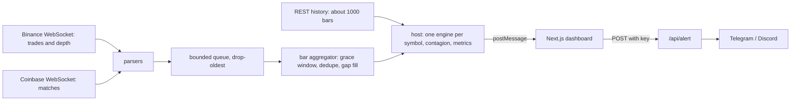

# SENTINEL

Real-time anomaly detection for crypto markets, with a pre-registered evaluation of whether it actually works.

**Live demo:** https://sentinel-one-phi.vercel.app &nbsp;·&nbsp; **Paper:** [docs/SENTINEL_paper.pdf](docs/SENTINEL_paper.pdf) &nbsp;·&nbsp; Research software, not financial advice.

## Headline result

At a nominal alarm budget of 6 alerts/day, on 40 BTC/ETH stress days (2020 to 2026) chosen by a rule fixed in advance:

- SENTINEL emitted **clearly fewer alerts** than an equally thresholded z-score: 4.8 vs 6.7 per quiet day (paired difference -1.86, 95% CI -2.31 to -1.42).
- Event recall **did not clearly change** (-0.03, 95% CI -0.14 to +0.08).
- **No evidence of earlier detection.** Online-learned weights were no better than fixed ones, and removing any single detector had no clear effect.
- Recall above a random alerter at the same alert rate is small (+0.06) and unproven. The classic |z| > 3 rule reaches 0.82 recall, exactly what chance gives at its 14 alerts/day.

The supported claim is about alert volume, not detection skill. Protocol, tables, limitations and the full event list are in the paper and in [docs/STUDY.md](docs/STUDY.md).

## What is here

- **Streaming engine** (TypeScript, causal, unit-tested): robust z-score, EWMA volatility ratio, CUSUM, Bayesian online changepoint detection, volume spike, and order-book imbalance (live only). Each statistic is normalised by a rolling empirical CDF, combined by a logistic ensemble (fixed prior or online-learned from delayed weak labels), and turned into alerts by per-symbol adaptive quantile thresholds with a cooldown and severity escalation. Cross-asset lead-lag tracking.
- **Live dashboard** (Next.js; runs in your browser): Binance and Coinbase WebSockets, a Web Worker engine, price chart with anomaly score, heatmap across symbols, a "why did this fire" panel, and throughput / latency metrics.
- **Alert route** (`/api/alert`): Telegram and Discord messages. Fails closed, validates input, plain text only.
- **Replay and study harness**: a pre-registered evaluation with a random-alert chance baseline, cluster-bootstrap intervals and paired comparisons, run on GitHub Actions.
- **57 automated tests**, including one asserting that two engines fed different futures give identical past outputs (no lookahead).

## Architecture



The same `SentinelEngine.update(bar)` runs live and in replay, so there is no train/serve skew.

## Try it

- **Live:** open the demo and press **Start**. US users: pick *binance.us* in the header.
- **Locally** (Node 22 or newer):
  ```bash
  npm install
  npm run dev      # http://localhost:3000
  npm test         # 57 tests
  ```
- **Deploy:** import the repo on Vercel (Next.js is detected automatically). The alert route stays disabled until you set `ALERT_API_KEY` (and Telegram or Discord variables, see `.env.example`).

## Reproduce the study

No local setup needed. In the repo open **Actions**, choose the **study** workflow and press **Run workflow**. It runs the tests, applies the event rule to Binance Vision daily data, downloads the 1-minute files for the 40 events, replays every method, and prints the tables on the run summary. The frozen parameters are in [`eval/study.json`](eval/study.json); the results record its hash and the commit.

## Repository layout

| Path | Contents |
|---|---|
| `src/engine/` | detectors, ensemble, thresholds, contagion, engine |
| `src/feeds/` | aggregator, reconnecting socket, parsers, history, queue |
| `src/worker/` | host and Web Worker entry |
| `src/app/`, `src/components/`, `src/lib/` | dashboard and alert route |
| `eval/` | replay harness, study selection and runner, statistics |
| `tests/` | 57 unit and end-to-end tests |
| `docs/` | study protocol and paper |

## Limitations

- At the same nominal budget the methods produced different realised alert rates (4.8 vs 6.7 per day), so the alert-volume and recall results are not a like-for-like comparison. Matched-rate comparisons are the first item for v2.
- The study's onset rule anchors on the UTC day open; in 22 of 40 events the onset falls within 30 minutes after midnight, which adds noise for every method.
- The 40 events are the largest-range days, strongly correlated across BTC and ETH, so the study speaks to obvious shocks, not subtle regime changes.
- The order-book detector could not be tested historically (no free historical level-2 data) and runs only in the live dashboard.
- Alerts fire only while a dashboard tab is open. The pre-registration is a hashed commit in the author's own repository, not a third-party registry.

## Data, credits and licence

- Historical data: [Binance Vision](https://data.binance.vision), licensed CC BY-NC-SA 4.0 for non-commercial use. Raw data is not included in this repository; results derived from it (including the paper's tables) are shared under the same licence. Please credit Binance Vision.
- Live feeds use the public Binance and Coinbase market-data streams under their own terms. This project is not affiliated with or endorsed by Binance or Coinbase.
- Charts use [TradingView Lightweight Charts](https://github.com/tradingview/lightweight-charts) (Apache-2.0; the attribution logo on the chart is required). Built with Next.js and React.
- Keep any deployment non-commercial. Research software, not trading advice.

## What is next

A clearly labelled **exploratory v2**, designed after seeing the results above: a trailing-reference onset rule, recall-versus-realised-alert-rate curves with paired skill intervals, a held-out set of events (the next 40 ranked days), subtle events such as volatility regime shifts, a longer warm-up for the learned variant, and recorded live level-2 data to test the order-book detector.
